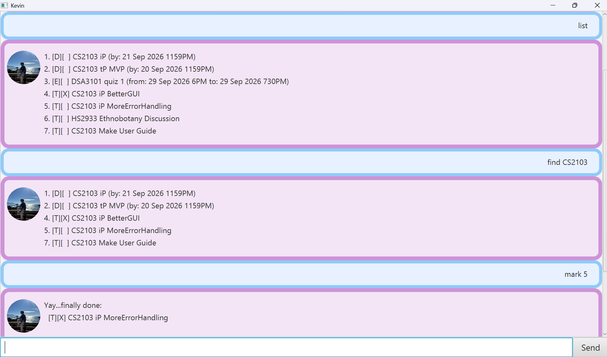

# Kevin User Guide

Kevin is an interactive chatbot that you can you use to store and manage your Tasks.

## Installation and Setting up
1. Ensure that Java 25 or later is installed on your computer.\
Mac users: Ensure you have the precise JDK version prescribed [here](https://se-education.org/guides/tutorials/javaInstallationMac.html).
2. Download the latest .jar file from [here](https://github.com/mizzfain/ip/releases) (currently is v0.2).
3. Copy the file to the folder you want to use as the home folder for your tasks.

## Using the App
1. Open a terminal, cd to the folder containing the JAR file, and run java -jar kevin.jar.
A GUI similar to the one below should appear in a few seconds.


2. Type a command in the command box and press Enter or click on the Send button to execute it.\
For example, type `list` to display any previously saved Tasks as shown in the snapshot above.

# Features
## Understanding commands
In the command formats below:
- Words in `UPPER_CASE` are parameters you supply.\
For example, in `todo DESCRIPTION`, replace `DESCRIPTION` with a value like `buy groceries` so the command would be `todo buy groceries`
- For DateTimes, use `d/m/yy HMMam/pm`. Alternatively, you can use `Ham/pm` for the time if the minutes are not required.\
For example, `9/12/26 730am` or `18/9/26 12pm`

## Adding Tasks
There are 3 types of Tasks that can be added. ToDos, Deadlines, and Events.
## ToDos
ToDos are the most basic Task with just a description.

Format:`todo DESCRIPTION`

Example usage: `todo buy groceries`
## Deadlines

Deadlines are Tasks with a by DateTime. 

Format: `deadline DESCRIPTION /by DATETIME`

Example usage: `deadline clean room /by 20/9/26 12pm`

## Events

Events are Tasks with a from and to DateTime. 

Format: `event DESCRIPTION /from DATETIME /to DATETIME`

Example usage: `event project meeting /from 17/2/26 1pm /to 17/2/26 130pm`


## Viewing Tasks
###  All Tasks
To view all your Tasks as a list, use `list`

Example usage: `list`

Example output:
```
1. [T][ ] buy groceries
2. [D][X] clean room (by: 20 Sep 2026 12PM)
3. [E][ ] project meeting (from: 27 Oct 2026 1PM to: 27 Oct 2026 130PM)
```
Some things to note to understand the output:
- Tasks are given a number to identify them e.g `1.` This number is used in other commands.
- The first `[ ]` is the type of Task. `T`,`D`and `E`represent Task, Deadline and Event respectively.
- The second `[ ]` show whether a task has been completed. `[X]` means done and `[ ]` means not done.
- This is followed by the description of the task and any DateTimes relevant to the Task.

### Tasks with a specific keyword
To find tasks containing a certain keyword, use `find`

Format: `find KEYWORD`

For example, `find room` gives the output:

```
2. [D][X] clean room (by: 20 Sep 2026 12PM)
```
## Marking Tasks

Tasks can be marked as done or not done using `mark` or `unmark` respectively.

To mark/unmark a Task, use the Task's number to identify it.

Format: `mark NUMBER` or `unmark NUMBER`

Example usage: `mark 3`

## Snoozing Tasks
For Tasks with a DateTime such as Deadline or Event, you can use `snooze` to postpone
the DateTime using the Task's number to identify it. 
For example, if Deadlines get extended or the Event reschedules. 

The format changes depending on the type of Task.

For Deadlines, use: `snooze NUMBER /by DATETIME`

For Events, use `snooze NUMBER /from DATETIME /to DATETIME`

## Deleting Tasks

When you have too many Tasks or simply want to remove completed/uncompleted ones, use `delete`.
Again, use the task's number to identify it.

Format: `delete NUMBER`

Example usage: delete `1`

# Closing the app
When you are done using Kevin, simple type `bye` to close the app. 
All tasks will be saved in the home folder of the `.jar` file in `data/tasks.txt`
and will be automatically loaded when you open the app again.